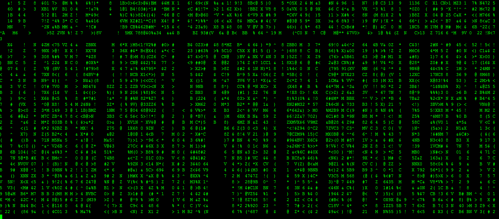

# Matrix
Matrix screensaver. Both Linux, MacOS and Windows version included.

## Matrix Shell Version

  ./matrix.sh
  
  
  
## Windows version
Just build and copy the binary file to system32.

## MacOS version
Build and execute the binary file to install it.
